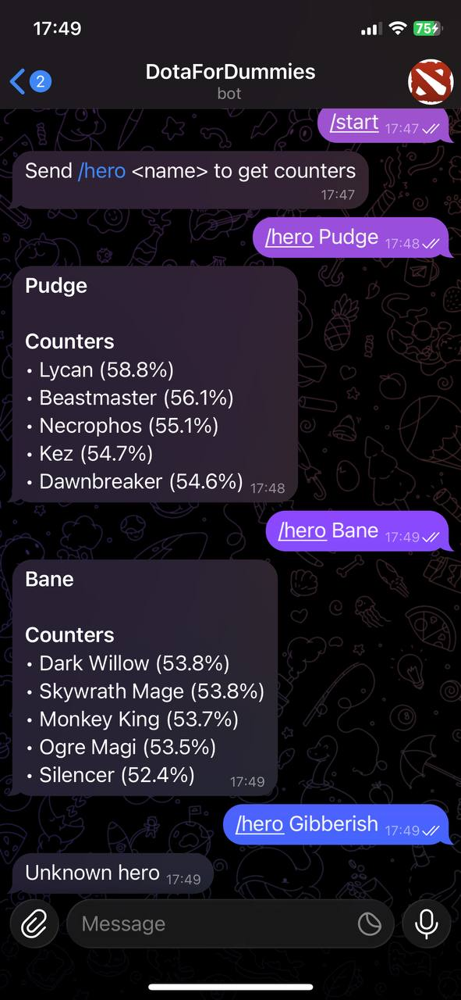

# Dota 2 Hero Adviser Telegram Bot

## Overview

This project is a Telegram bot written in Python that helps Dota 2 players make better draft decisions. The bot analyzes hero matchups and provides:

- **Best counter picks** against a chosen hero

The goal of the project is to demonstrate how to build a real-world Python backend, integrate a public game API, and expose the logic through a Telegram bot interface.

---

## What the Bot Does

1. A user sends a command to the bot with a Dota 2 hero name
2. The bot resolves the hero name to an internal hero ID
3. It fetches matchup statistics from the OpenDota API
4. The data is cleaned and filtered to remove low-sample and unreliable matchups
5. The bot calculates win rates using statistical smoothing
6. The bot replies with:
   - Heroes that counter the selected hero

The analysis is performed on-demand and uses cached hero metadata for fast responses.

---

## Data Source and API

This project uses the **OpenDota API**, a public API that provides parsed Dota 2 match data.

Key endpoints used:

- `GET /api/heroes`
  - Used to fetch the full list of Dota 2 heroes
  - Builds internal lookup tables (`hero_id → hero_name` and `hero_name → hero_id`)

- `GET /api/heroes/{hero_id}/matchups`
  - Provides win/loss statistics for hero vs hero matchups
  - Used to determine counters

Important notes about the API data:

- Matchup data does not have a fixed timeframe
- Some matchups have very small sample sizes
- Raw win rates are statistically noisy

To address this, the bot:

- Filters matchups below a minimum number of games
- Applies win rate smoothing to reduce small-sample bias
- Ranks results using confidence-weighted scores

---

## Project Structure

```
.
├── bot.py          # Telegram bot entry point
├── dota.py         # Backend logic and OpenDota integration
└── requirements.txt
```

- `bot.py` contains only Telegram-related code (commands, handlers, formatting)
- `dota.py` contains all Dota-specific logic, data loading, and analysis

This separation allows the backend logic to be reused or tested independently of Telegram.

---

## Example Output

Below is an example of the bot in action:


[Watch demo video](pics/demo.mp4)

The bot responds with a formatted list of counters, including win rate information derived from OpenDota match data.

---

## Technologies Used

- Python 3
- python-telegram-bot
- Requests
- OpenDota API

---

## Notes

This is a personal pet project built for learning purposes. It is not affiliated with Valve, Dota 2, or OpenDota.

The analysis is based on public match data and should be treated as guidance, not absolute truth.

---

